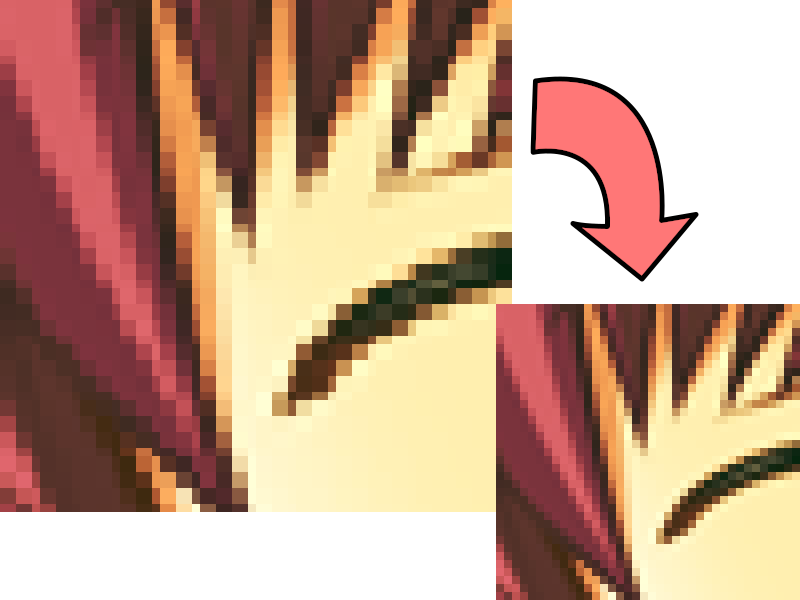

# deupscale

A tool for reverting nearest-neighbor image upscaling.



## Usage

- Try it [in your browser](https://xtsm.github.io/deupscale/)
- [Build](#build-and-test) and run locally:
  
  ```
  ./deupscale input.png output.png
  ```

## Misc info

- Works when the scaling factor is different on each axis
- Will probably do nothing if the image uses lossy compression (e.g. JPEG)
- May fail if the image has lots of equal (same color?) rows and/or columns
- May fail on big images due to OOM
- Take it or leave it
- PRs welcome lol

## Build

Build dependencies: none. ([stb_image and stb_image_write](https://github.com/nothings/stb) are included in this repo.)

Test dependencies: [ImageMagick](https://imagemagick.org).

```
$ make deupscale
$ ./test.sh
```
